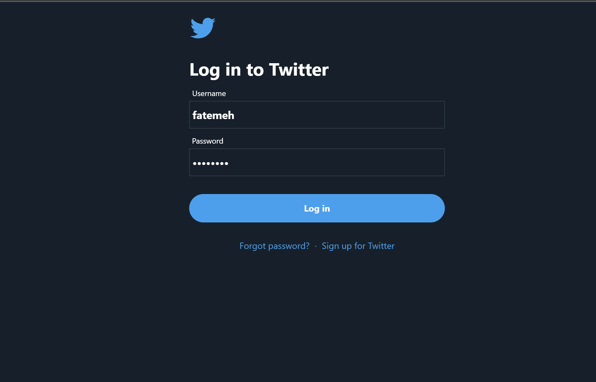
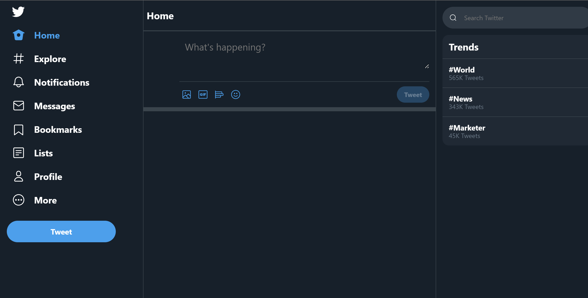
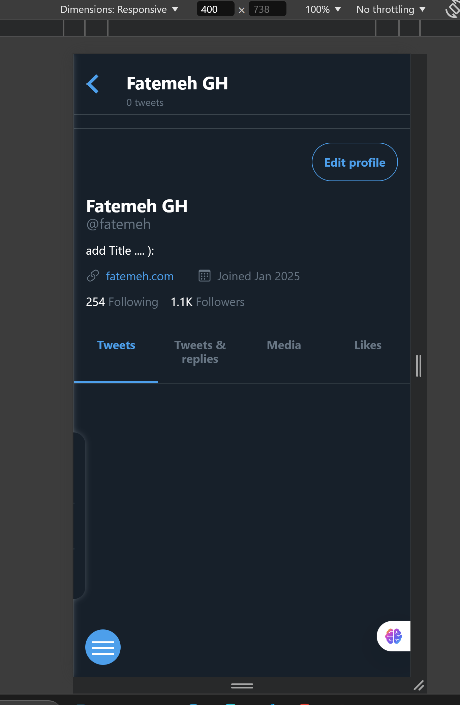

# Twitter-like Project

This project is a simulation of a Twitter-like social media platform built using Vue.js. It mimics core features such as login/logout, profile management, tweet posting, and more. The project is designed to replicate a basic environment similar to Twitter, providing a user-friendly interface and smooth interactions.

## Features

- **Login & Logout**: Users can log in and log out using mock data for authentication.
- **Profile Management**: Users can view and edit their profiles, including their profile picture and bio.
- **Tweet Posting**: Users can post tweets and view them in a timeline.
- **Tweet Deletion**: Users can delete their tweets.
- **Responsive Design**: The application is fully responsive, optimized for both mobile and desktop views.
- **Notifications**: Users will receive notifications when certain actions occur (e.g., tweet posting).
- **Trending Topics**: A section showing trending topics in a simulated manner.
- **Pop-up Tweet Window**: A pop-up window for composing tweets in a user-friendly interface.

## Technologies Used

- **Vue.js**: Frontend framework for building the user interface.
- **Vuex**: State management for handling global state such as user authentication and tweet data.
- **Mock Data**: Simulated backend data for authentication and interactions.
- **CSS/SCSS**: Styling of components and responsive design.

## Screenshots

## Installation

1. Clone the repository:
   
   git clone https://github.com/fatemeh-ghafari/vue-simx.git
